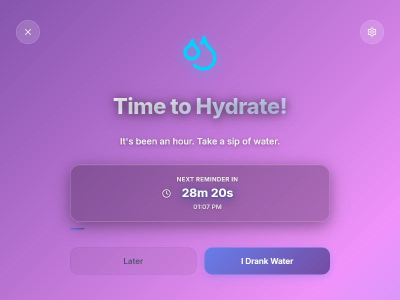
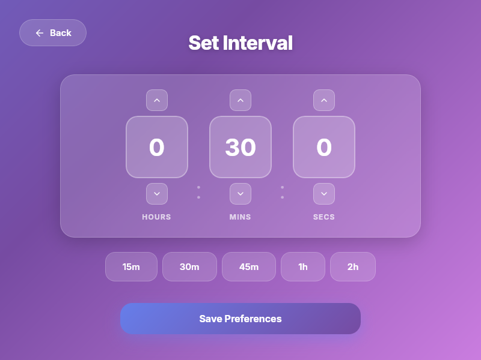

# 💧 Water Reminder

A beautiful, modern desktop application to help you stay hydrated throughout the day. This is a fun personal project that reminds you to drink water at customizable intervals, featuring a sleek UI with smooth animations and a system tray integration.


## 🎯 Goal

The primary goal of this project is to create a simple yet elegant reminder application that helps maintain healthy hydration habits. It runs quietly in the background and pops up with beautiful, non-intrusive reminders at customizable intervals.

## ✨ Features

- **🔄 Customizable Reminder Intervals** - Set reminders from seconds to hours
- **⏰ Live Countdown Timer** - See exactly when the next reminder will appear
- **⏭️ Snooze Functionality** - "Later" button snoozes reminders for 5 minutes
- **🎨 Modern UI/UX** - Beautiful glassmorphism design with animated gradients
- **🌙 System Tray Integration** - Runs in the background without cluttering your taskbar
- **🚀 Auto-start Support** - Automatically starts with your system
- **📱 Responsive Design** - Clean, modern interface with smooth animations
- **🎭 Material Design 3** - Dynamic theming with customizable colors

## 🛠️ Technology Stack

### Frontend
- **React 19** - Modern React with latest features
- **TypeScript** - Type-safe development
- **Vite** - Fast build tool and dev server
- **Framer Motion** - Smooth animations and transitions
- **Lucide React** - Beautiful icon library
- **Material Design 3** - Dynamic color theming

### Backend
- **Rust** - High-performance system programming
- **Tauri 2** - Lightweight framework for building desktop apps
- **Tauri Plugins**:
  - `tauri-plugin-autostart` - Auto-start on system boot
  - `tauri-plugin-opener` - System integration
  - System tray support

### Build Tools
- **Vite** - Frontend bundling
- **Cargo** - Rust package manager
- **TypeScript** - Type checking

## 🏗️ Architecture

### Project Structure

```
water-reminder/
├── src/                          # Frontend React application
│   ├── components/               # React components
│   │   ├── ReminderScreen.tsx   # Main reminder popup
│   │   ├── SettingsScreen.tsx   # Settings and interval configuration
│   │   └── StartupScreen.tsx    # Initial welcome screen
│   ├── theme/                    # Theme management
│   │   └── theme.tsx            # Material Design 3 theming
│   ├── App.tsx                   # Main app component
│   └── index.css                 # Global styles
├── src-tauri/                     # Rust backend
│   ├── src/
│   │   └── lib.rs               # Main Rust logic
│   ├── Cargo.toml               # Rust dependencies
│   └── tauri.conf.json          # Tauri configuration
└── package.json                  # Node.js dependencies
```

### Architecture Overview

The application follows a **hybrid architecture** combining:

1. **Frontend (React/TypeScript)**
   - Handles all UI rendering and user interactions
   - Manages state for screens and animations
   - Communicates with backend via Tauri commands

2. **Backend (Rust)**
   - Manages reminder timing logic
   - Handles system tray integration
   - Persists settings to disk
   - Controls window visibility

3. **Communication Layer**
   - Tauri commands for frontend-backend communication
   - Event system for reminder triggers
   - Shared state management

### Key Components

#### ReminderScreen
- Displays the hydration reminder
- Shows live countdown timer
- Provides action buttons (Later, I Drank Water)
- Features animated water icon and progress bar

#### SettingsScreen
- Time interval configuration (Hours, Minutes, Seconds)
- Quick preset buttons (15m, 30m, 45m, 1h, 2h)
- Material Design 3 theming options
- Settings persistence

#### Backend (lib.rs)
- `AppState` - Shared state for interval and timing
- `get_settings()` - Retrieve current interval
- `update_settings()` - Save new interval
- `snooze_reminder()` - Snooze for 5 minutes
- `get_next_reminder_time()` - Get countdown time
- Background thread monitors elapsed time and triggers reminders

### Data Flow

1. **Reminder Trigger**: Background thread checks elapsed time every second
2. **Window Display**: When interval is reached, window is shown and event is emitted
3. **User Interaction**: User can dismiss, snooze, or acknowledge drinking
4. **State Update**: Backend updates `last_shown` timestamp
5. **Countdown**: Frontend displays live countdown with local decrement + periodic sync

## 📸 Screenshots

### Reminder Screen

*Beautiful reminder popup with live countdown timer and animated water icon*

### Settings Screen

*Intuitive interval configuration with quick presets and Material Design 3 theming*


## 🚀 Getting Started

### Prerequisites

- **Node.js** 18+ and npm/pnpm/yarn
- **Rust** (latest stable version)
- **System dependencies**:
  - Linux: `libwebkit2gtk-4.0-dev`, `libgtk-3-dev`, `libayatana-appindicator3-dev`
  - macOS: Xcode Command Line Tools
  - Windows: Microsoft Visual Studio C++ Build Tools

### Installation

1. **Clone the repository**
   ```bash
   git clone <your-repo-url>
   cd water-reminder
   ```

2. **Install dependencies**
   ```bash
   npm install
   # or
   pnpm install
   # or
   yarn install
   ```

3. **Run in development mode**
   ```bash
   npm run tauri dev
   ```

4. **Build for production**
   ```bash
   npm run tauri build
   ```

## 📖 Usage

### First Launch
1. The app shows a welcome screen for 3 seconds
2. It then minimizes to the system tray
3. Reminders will appear at the configured interval (default: 1 hour)

### Setting Reminder Interval
1. Click the settings icon (gear) in the reminder popup
2. Adjust Hours, Minutes, and Seconds using the up/down buttons
3. Or use quick presets (15m, 30m, 45m, 1h, 2h)
4. Click "Save Preferences"

### Reminder Actions
- **"I Drank Water"** - Acknowledges drinking and resets the timer
- **"Later"** - Snoozes the reminder for 5 minutes
- **Close (X)** - Hides the window (app continues running in background)
- **Settings (⚙️)** - Opens settings to configure intervals

### System Tray
- The app runs in the system tray
- Click the tray icon to show the window
- Right-click for menu options (Open, Quit)

## 🎨 Design Philosophy

This project emphasizes:
- **Minimalism** - Clean, uncluttered interface
- **Visual Appeal** - Modern glassmorphism and gradient effects
- **Smooth Animations** - Framer Motion for fluid transitions
- **User Experience** - Intuitive controls and clear feedback
- **Non-intrusive** - Respects user workflow while providing gentle reminders

## 🔧 Development

### Project Scripts

```bash
npm run dev          # Start Vite dev server (frontend only)
npm run tauri dev    # Start Tauri dev mode (full app)
npm run build        # Build frontend
npm run tauri build  # Build production app
```

### Code Style
- TypeScript strict mode enabled
- React functional components with hooks
- Rust follows standard conventions
- CSS uses modern features (backdrop-filter, CSS variables)

### Adding Features
1. Frontend changes: Edit files in `src/`
2. Backend changes: Edit `src-tauri/src/lib.rs`
3. New Tauri commands: Add to `invoke_handler` in `lib.rs`
4. Styling: Update `src/index.css`

## 📝 License

This is a personal fun project. Feel free to use, modify, and learn from it!

## 🙏 Acknowledgments

- Built with [Tauri](https://tauri.app/) - Amazing framework for desktop apps
- UI inspiration from modern design systems
- Icons from [Lucide](https://lucide.dev/)

---

**Stay hydrated! 💧**
